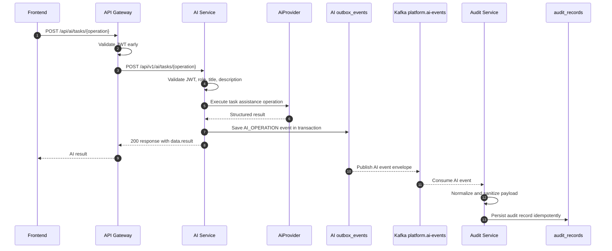

# AI Service Audit Flow

The current `dev` and `test` profiles use `TemporaryNoOpAiProvider` when no
other `AiProvider` bean exists. This checkout does not include an Ollama
provider implementation; replace the `Provider` participant with Ollama only
after code introduces a concrete Ollama-backed provider and configuration.