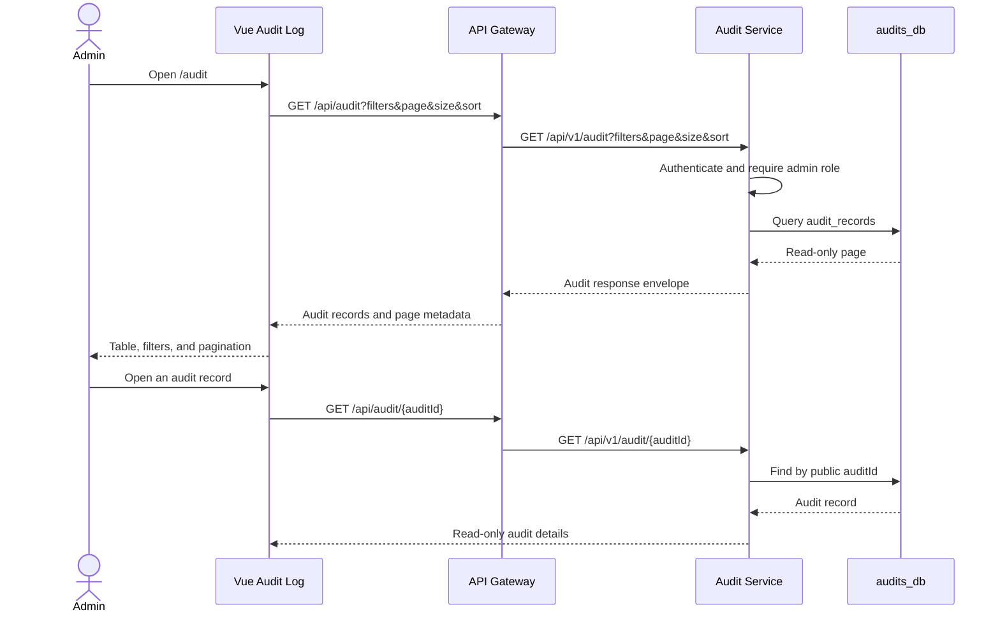

# Audit Log Read Flow

The UI never exposes the database primary key and does not provide audit write,
delete, replay, or export actions. Audit Service remains authoritative for
admin authorization.
