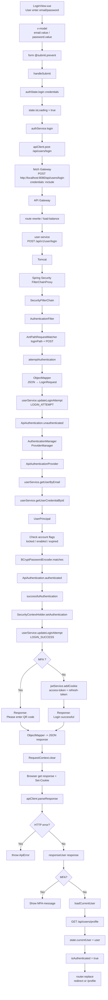

# login flow

```mermaid
flowchart TD
    A[LoginView.vue<br/>User enter email/password]
    A --> B[v-model<br/>email.value / password.value]
    B --> C[form @submit.prevent]
    C --> D[handleSubmit]
    D --> E[authState.login credentials]
    E --> F[state.isLoading = true]
    F --> G[authService.login]
    G --> H[apiClient.post /api/users/login]
    H --> I[fetch Gateway<br/>POST http://localhost:8080/api/users/login<br/>credentials: include]

    I --> J[API Gateway]
    J --> K[route rewrite / load-balance]
    K --> L[user-service<br/>POST /api/v1/user/login]

    L --> M[Tomcat]
    M --> N[Spring Security FilterChainProxy]
    N --> O[SecurityFilterChain]
    O --> P[AuthenticationFilter]
    P --> Q[AntPathRequestMatcher loginPath + POST]
    Q --> R[attemptAuthentication]
    R --> S[ObjectMapper<br/>JSON → LoginRequest]
    S --> T[userService.updateLoginAttempt<br/>LOGIN_ATTEMPT]
    T --> U[ApiAuthentication.unauthenticated]
    U --> V[AuthenticationManager<br/>ProviderManager]
    V --> W[ApiAuthenticationProvider]
    W --> X[userService.getUserByEmail]
    X --> Y[userService.getUserCredentialById]
    Y --> Z[UserPrincipal]
    Z --> AA[Check account flags<br/>locked / enabled / expired]
    AA --> AB[BCryptPasswordEncoder.matches]
    AB --> AC[ApiAuthentication.authenticated]
    AC --> AD[successfulAuthentication]
    AD --> AE[SecurityContextHolder.setAuthentication]
    AE --> AF[userService.updateLoginAttempt<br/>LOGIN_SUCCESS]

    AF --> AG{MFA ?}
    AG -- Yes --> AH[Response:<br/>Please enter QR code]
    AG -- No --> AI[jwtService.addCookie<br/>access-token + refresh-token]
    AI --> AJ[Response:<br/>Login successful]

    AH --> AK[ObjectMapper -> JSON response]
    AJ --> AK
    AK --> AL[RequestContext.clear]
    AL --> AM[Browser get response + Set-Cookie]

    AM --> AN[apiClient.parseResponse]
    AN --> AO{HTTP error?}
    AO -- Yes --> AP[throw ApiError]
    AO -- No --> AQ[responseUser response]

    AQ --> AR{MFA?}
    AR -- Yes --> AS[Show MFA-message]
    AR -- No --> AT[loadCurrentUser]
    AT --> AU[GET /api/users/profile]
    AU --> AV[state.currentUser = user]
    AV --> AW[isAuthenticated = true]
    AW --> AX[router.replace<br/>redirect or /profile]
```
