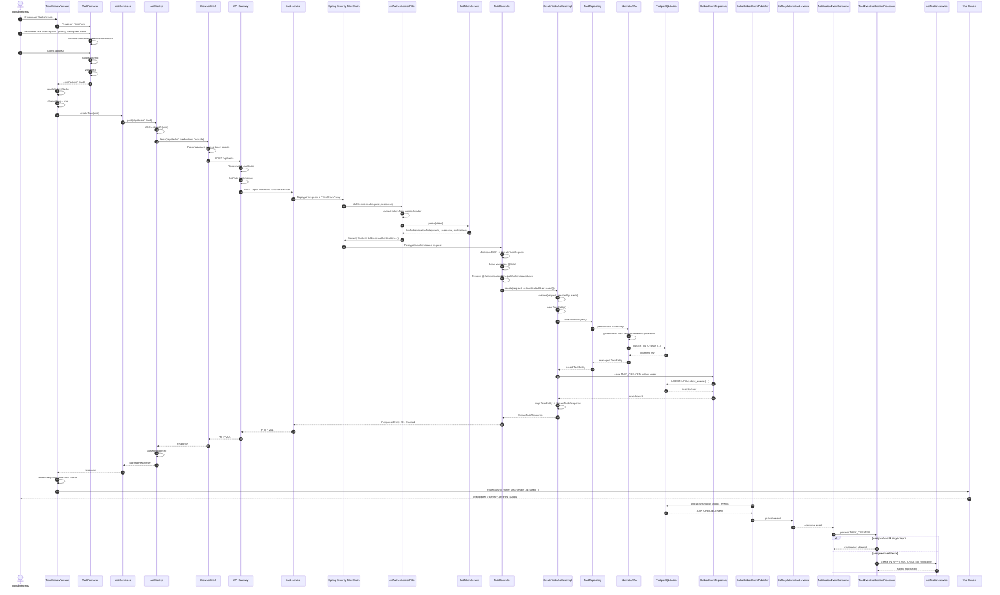

```mermaid
sequenceDiagram
    autonumber

    actor User as Пользователь
    participant View as TaskCreateView.vue
    participant Form as TaskForm.vue
    participant TaskService as taskService.js
    participant ApiClient as apiClient.js
    participant Browser as Browser fetch
    participant Gateway as API Gateway
    participant TaskApp as task-service
    participant Security as Spring Security FilterChain
    participant JwtFilter as JwtAuthenticationFilter
    participant JwtService as JwtTokenService
    participant Controller as TaskController
    participant UseCase as CreateTaskUseCaseImpl
    participant Repository as TaskRepository
    participant Hibernate as Hibernate/JPA
    participant DB as PostgreSQL tasks
    participant Outbox as OutboxEventRepository
    participant OutboxPublisher as KafkaOutboxEventPublisher
    participant Kafka as Kafka platform.task-events
    participant Consumer as NotificationEventConsumer
    participant Processor as TaskEventNotificationProcessor
    participant NotifService as notification-service
    participant Router as Vue Router

    User->>View: Открывает /tasks/create
    View->>Form: Рендерит TaskForm

    User->>Form: Заполняет title / description / priority / assigneeUserId
    Form->>Form: v-model обновляет reactive form state

    User->>Form: Submit формы
    Form->>Form: handleSubmit()
    Form->>Form: validate()
    Form-->>View: emit('submit', task)

    View->>View: handleSubmit(task)
    View->>View: isSubmitting = true
    View->>TaskService: createTask(task)

    TaskService->>ApiClient: post('/api/tasks', task)
    ApiClient->>ApiClient: JSON.stringify(task)
    ApiClient->>Browser: fetch('/api/tasks', credentials: 'include')
    Browser->>Browser: Прикладывает access-token cookie

    Browser->>Gateway: POST /api/tasks
    Gateway->>Gateway: Route match /api/tasks
    Gateway->>Gateway: SetPath /api/v1/tasks
    Gateway->>TaskApp: POST /api/v1/tasks via lb://task-service

    TaskApp->>Security: Передаёт request в FilterChainProxy
    Security->>JwtFilter: doFilterInternal(request, response)
    JwtFilter->>JwtFilter: extract token from cookie/header
    JwtFilter->>JwtService: parse(token)
    JwtService-->>JwtFilter: JwtAuthenticationData(userId, username, authorities)
    JwtFilter->>Security: SecurityContextHolder.setAuthentication(...)

    Security->>Controller: Передаёт authenticated request
    Controller->>Controller: Jackson JSON -> CreateTaskRequest
    Controller->>Controller: Bean Validation @Valid
    Controller->>Controller: Resolve @AuthenticationPrincipal AuthenticatedUser

    Controller->>UseCase: create(request, authenticatedUser.userId())
    UseCase->>UseCase: validate(request, createdByUserId)
    UseCase->>UseCase: new TaskEntity(...)
    UseCase->>Repository: saveAndFlush(task)

    Repository->>Hibernate: persist/flush TaskEntity
    Hibernate->>Hibernate: @PrePersist sets taskId/createdAt/updatedAt
    Hibernate->>DB: INSERT INTO tasks (...)
    DB-->>Hibernate: inserted row
    Hibernate-->>Repository: managed TaskEntity
    Repository-->>UseCase: saved TaskEntity

    UseCase->>Outbox: save TASK_CREATED outbox event
    Outbox->>DB: INSERT INTO outbox_events (...)
    DB-->>Outbox: inserted row
    Outbox-->>UseCase: saved event
    UseCase->>UseCase: map TaskEntity -> CreateTaskResponse

    UseCase-->>Controller: CreateTaskResponse
    Controller-->>TaskApp: ResponseEntity 201 Created
    TaskApp-->>Gateway: HTTP 201
    Gateway-->>Browser: HTTP 201
    Browser-->>ApiClient: response
    ApiClient->>ApiClient: parseResponse()
    ApiClient-->>TaskService: parsed Response
    TaskService-->>View: response

    View->>View: extract response.data.task.taskId
    View->>Router: router.push({ name: 'task-details', id: taskId })
    Router-->>User: Открывает страницу деталей задачи

    OutboxPublisher->>DB: poll NEW/FAILED outbox_events
    DB-->>OutboxPublisher: TASK_CREATED event
    OutboxPublisher->>Kafka: publish event
    Kafka-->>Consumer: consume event
    Consumer->>Processor: process TASK_CREATED

    alt assigneeUserId отсутствует
        Processor-->>Consumer: notification skipped
    else assigneeUserId есть
        Processor->>NotifService: create IN_APP TASK_CREATED notification
        NotifService-->>Processor: saved notification
    end
```
